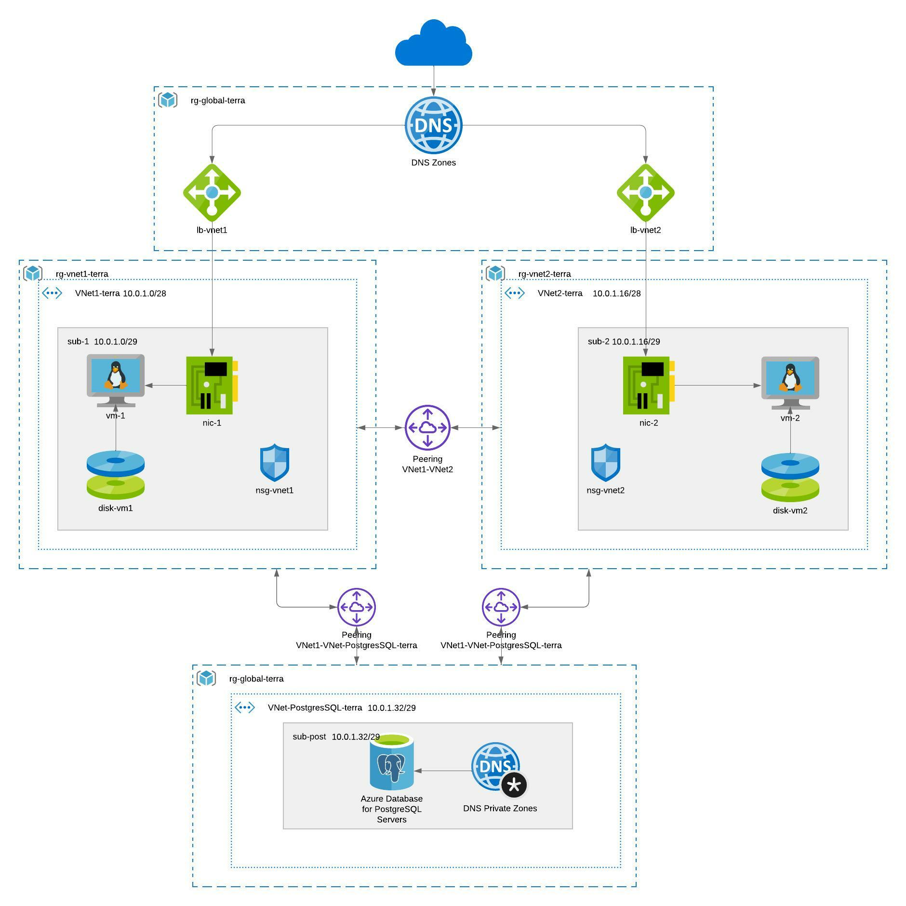

This is an example of cloud infrastructure in Microsoft Azure using Terraform and Terragrunt. 
It is a good example of infrastructure for a basic online shop etc.

### DESCRIPTION OF FILES

In this project we have three terraform files in folder main:

-   main.tf,
    
-   variables.tf
    
-   outputs.tf
    
-   terragrunt.hcl files
    

  

In file main.tf are all resources needed to build infrastructure. You can easily change in code for example private addresses, name of components or type. To use DNS you need to exchange data for DNS with your own domain and use correct records.

File variables.tf is made for easier changing some variables used in main.tf. You don’t need to change the main.tf file in every line, you can just change the name of it in variables.tf and it will change name in the whole project. In my project are three variables:

-   `location` - it’s region where resource will be deployed (to change this variable you need to go to file terragrunt.hcl, it’s used for Terragrunt tests in project)
    
-   `admin` - it’s username for components where user or admin name is need, for example vm
    
-   `any` - this variable is used for nsg rules where we want to use any value, which is by default ‘*’
    

The last file is outputs.tf where we have example outputs which are showing after deploying infrastructure. In project are three outputs:

-   `ip_loadbalancer_vnet1` - it is showing a public ip of load balancer connected to VNet1
    
-   `ip_loadbalancer_vnet2` - it is showing a public ip of load balancer connected to VNet2
    
-   `system_version_of_vm` - it is showing a version of Linux installed on vm
    

Files named terragrunt.hcl have configuration for using Terragrunt in the project. 

### USING A CODE

1. To use code and deploy infrastructure firstly you need to install on your PC:

	-   Terraform
    
	-   Terragrunt
    

2. Next step you must login to your Microsoft Azure account using bash or another console. You need to generate your own rsa keys and put it in a folder where you have a project or change a path to rsa key in main.tf. You need also to change data in terragrunt.hcl using your own storage account and container which you made on Azure Portal.

3. When everything is ready you need to open the main folder of the project in bash. After this you need to simply use three commands:

	1.  `terragrunt init` - used to start Terragrunt
    
	2.  `terragrunt plan` - used to check code that is good and no errors
    
	3.  `terragrunt apply` - used to deploy infrastructure, you need to write ‘yes’ to confirm
    

The project will start to deploy. It can take a few minutes. After finishing you will see information about the end of build and three outputs.

4. If you want to check your DNS works fine you need to login by console to vms and install NGINX on them. After this you can connect to them using a browser with your address domain.
